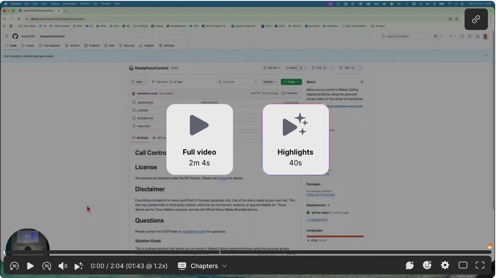

# Call Control Widget

# License
All contents are licensed under the MIT license. Please see [license](LICENSE) for details.

# Disclaimer
Everything included is for demo and Proof of Concept purposes only. Use of the site is solely at your own risk. This site may contain links to third party content, which we do not warrant, endorse, or assume liability for. These demos are for Cisco Webex usecases, but are not Official Cisco Webex Branded demos.

# Questions
Please contact the CCEP team at [ccep@cisco.com](mailto:ccep@cisco.com?subject=payment-collections-demo) for questions.

### Solution Goals
This is a simple solution that allows you to control a Webex Calling registered phone using the personal access token of the owner of that phone.  It is designed to be used as a tool to demonstrate how functions that CTI used to provide can be achieved using Webex Calling call control API's.

### Solution Video Overview

# Change Log

|Change Title|Date|Details|
|:---|:---:|:---|
|Initial Release|10/29/25|Initial release of tool|
